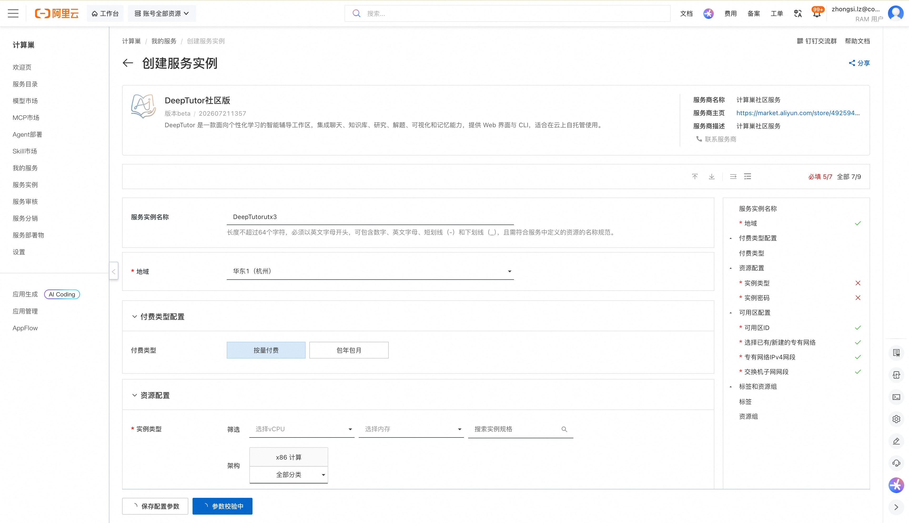
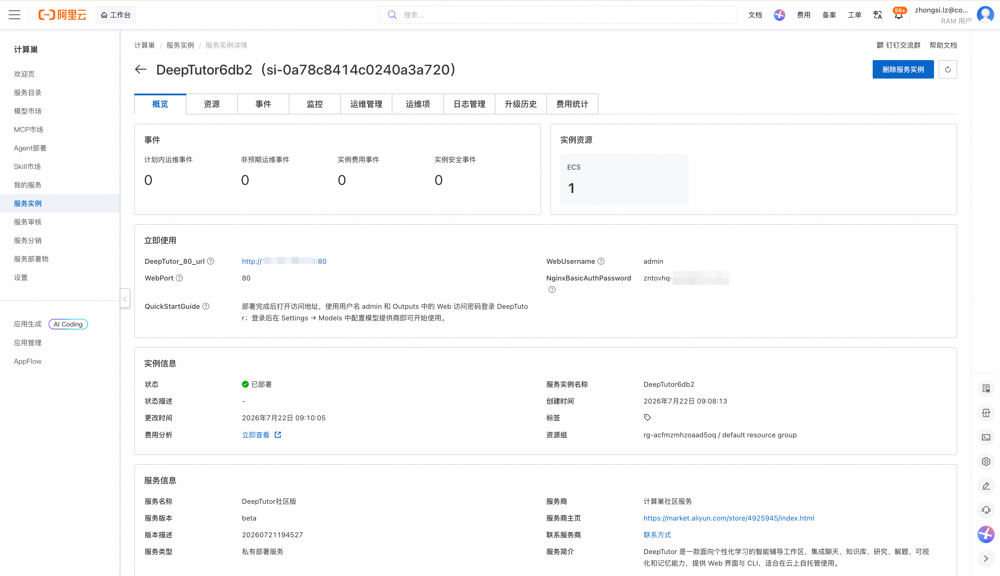
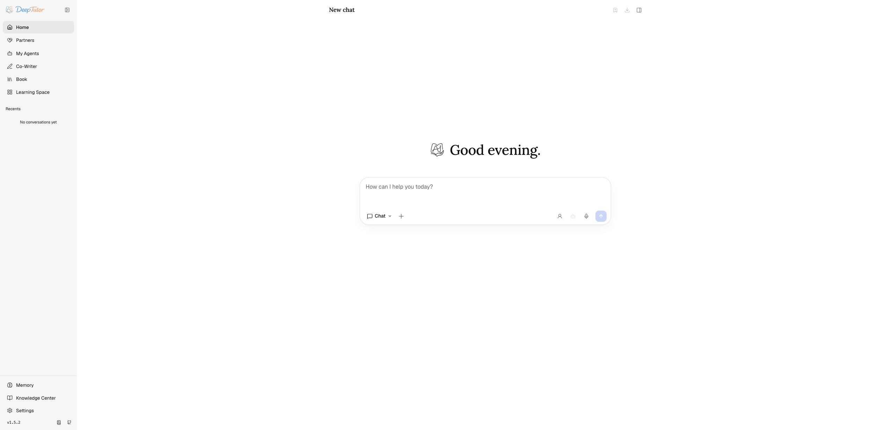
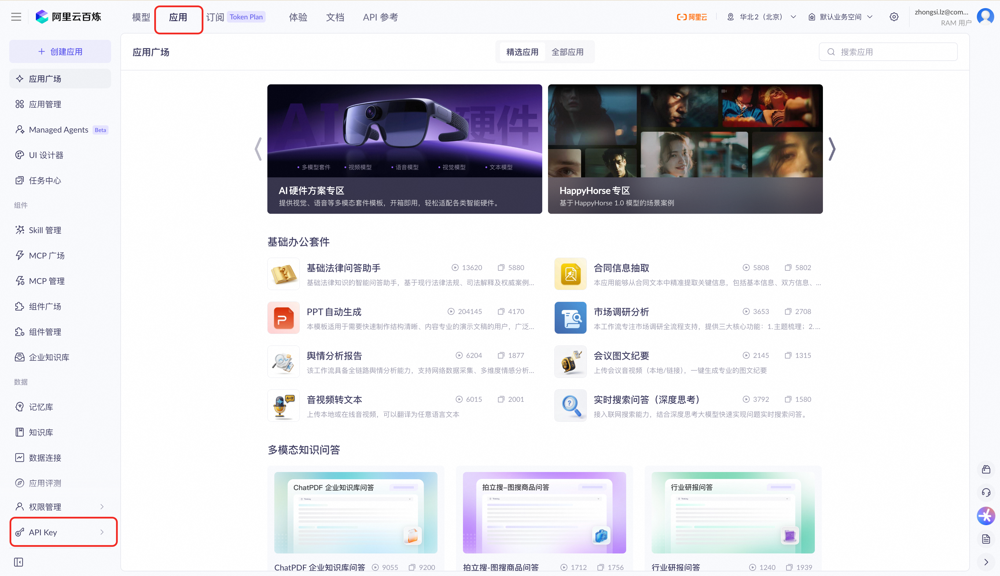
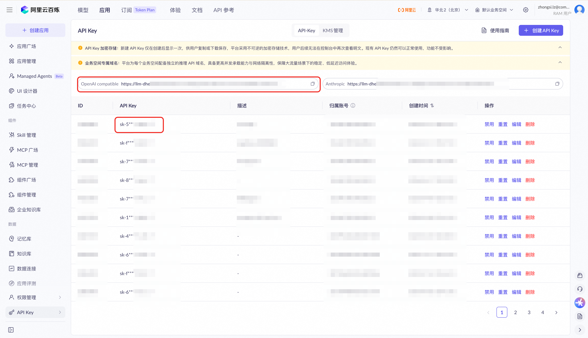
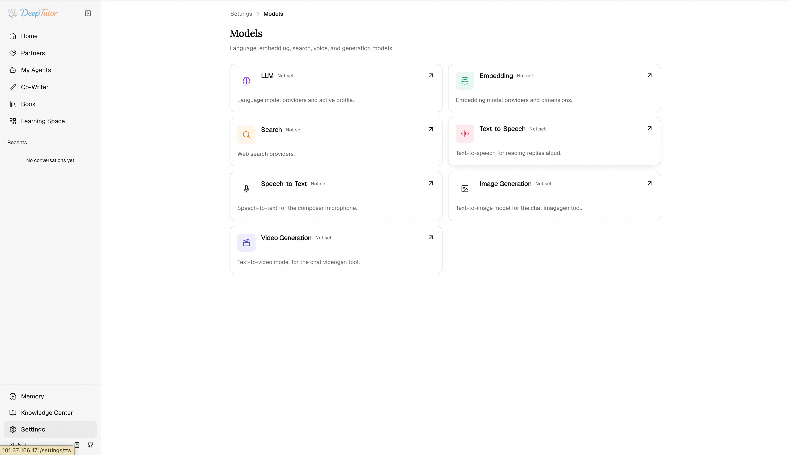
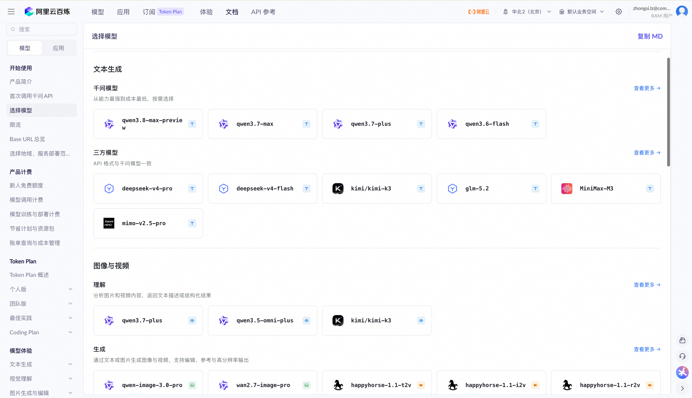
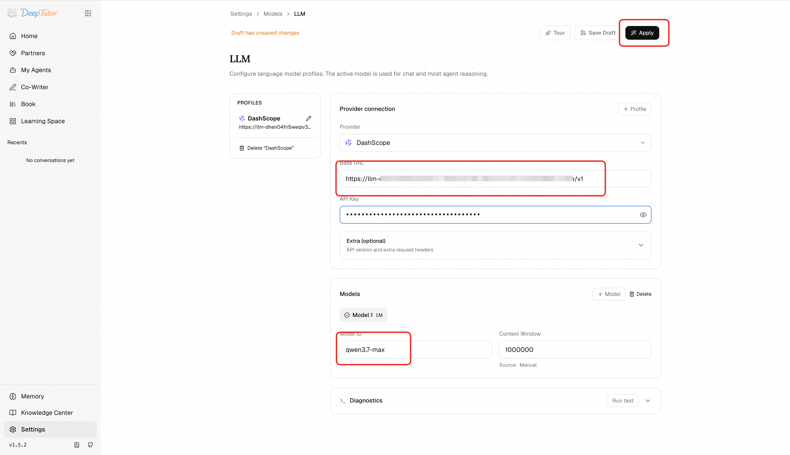

# DeepTutor社区版 部署文档

## 概述

DeepTutor社区版 是一款面向个性化学习的智能辅导工作区。通过阿里云计算巢服务，您可以快速部署 DeepTutor社区版，实现开箱即用。

## 部署流程

### 1. 创建服务实例

访问 DeepTutor社区版 服务部署链接，按提示填写部署参数：

[部署链接](https://computenest.console.aliyun.com/service/instance/create/cn-hangzhou?type=user&ServiceId=service-5b2d9ae6ee43446bb608)

### 2. 确认订单并创建

参数填写完成后可以看到对应询价明细，确认参数后点击 **下一步：确认订单**。确认订单完成后同意服务协议并点击 **立即创建** 进入部署阶段。

### 3. 等待部署完成

等待部署完成后进入服务实例管理，在控制台找到 DeepTutor社区版 访问链接。

### 4. 访问服务

部署完成后点击web安全代理，登录 DeepTutor；登录后在 Settings → Models 中配置模型提供商即可开始使用。请注意，根据您使用功能的不同配置的模型类别也有差异。例如，如果您需要使用知识库能力，则需要配置向量模型。您至少需要配置对话大模型才能体验最基础的能力。

#### 如何获取和设置百炼大模型
1. 登录 [百炼](https://bailian.console.aliyun.com/cn-beijing)，点击“应用” -> “API KEY”

2. 记录您的api key以及页面上的OpenAI compatible（即大模型访问地址）

3. 进入DeepTutor社区版，在Settings → Models中配置百炼大模型。Settings -> Models

您需要根据您使用的功能设置对应的大模型，例如对话大模型、向量模型、多模态语音大模型、多模态图像大模型等。模型列表您可以从[模型列表](https://bailian.console.aliyun.com/cn-beijing?tab=doc#/doc/?type=model&url=2840914)获取。

4. 填写模型信息后，点击apply即可生效

## 官方文档

更多信息请访问官方文档：[HKUDS/DeepTutor](https://github.com/HKUDS/DeepTutor)
